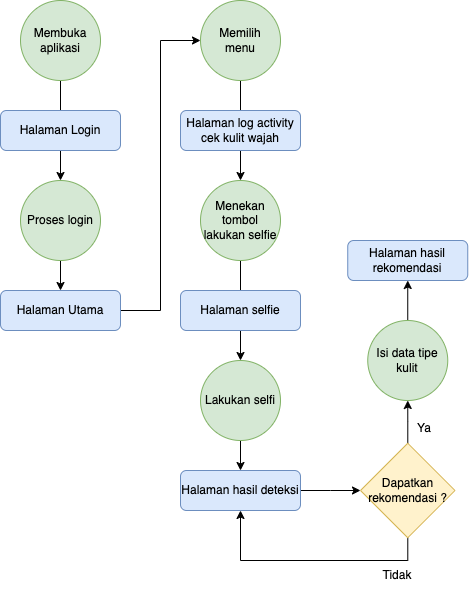
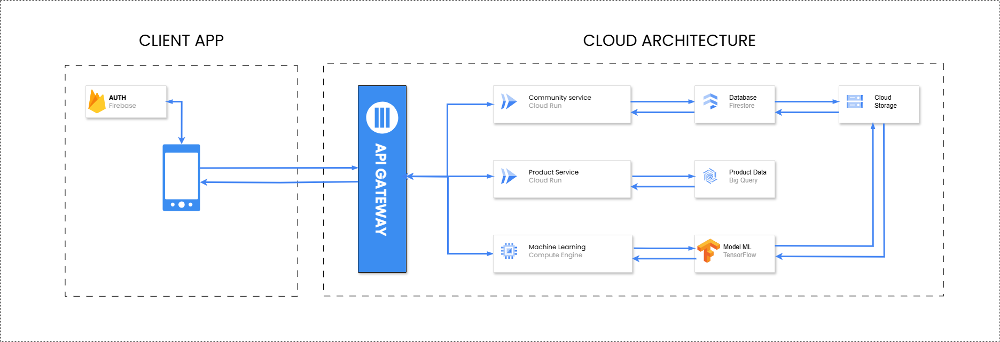
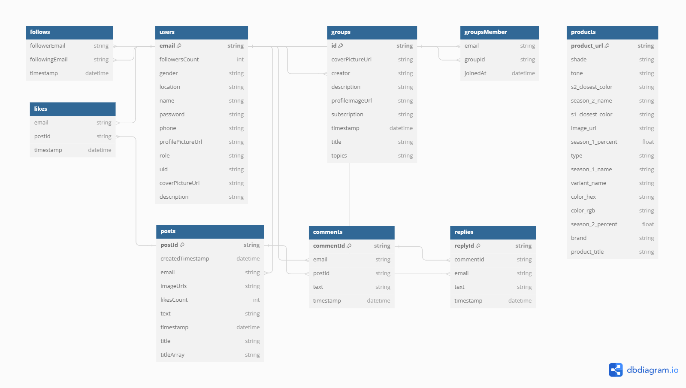

# Foundie

Foundie is here to address the problem of low self-confidence that many people, especially women, often experience regarding their appearance. Based on data from a Watson survey, 50% of Asian women feel insecure about their appearance. While many women turn to makeup to improve their appearance, in-depth interviews conducted by our development team revealed that they still struggle to determine the makeup style that best suits their facial features

# Current Features

This was the early features that this applications have.

1. Authentication

   

2. Face Classification

   

3. Skin Tone

   

4. Color analysis

   

5. Product Comparison

   

6. community

   

# Technical Details

## Foundie Android Applications

The mobile application is made starting with UI/UX designs and a little UX research, then implementing the design results using native Kotlin Android by utilizing supporting libraries such as Retrofit to interact with APIs, ViewModel to maintain stable live data, and Firebase Google Authentication to process user authentication.

**Flow Android**

## Foundie Cloud Computing Platform

We’ve developed a robust backend application using a microservices architecture. Our main server is built with NestJS, complemented by additional microservices using Hapi.js and Flask. Firebase handles user authentication, while BigQuery powers data analysis. Google Cloud Storage stores files, and Cloud Monitoring ensures performance monitoring. For seamless deployment, we rely on Cloud Run, with CI/CD pipelines managed by Cloud Build. Our data is securely stored in Firestore. This cohesive setup ensures efficient, scalable cloud computing

**API Documentation :** https://github.com/foundie/CC

**Cloud Architecture**

**Database Structure**

**List Repostory for Cloud Computing**

#### 1. [Foundie](https://foundie-backend-dev-b3pq7ueuta-uc.a.run.app/) (API Gateway)

Implemented using NestJS Framework

#### 2. Other Service

There is three machine learning backend used in this project. Each of them is for their own models. The backend is implemented using Hapi Js and Flask.

- [Face-Classification-Service](https://github.com/foundie/CC/tree/backend-flask-dev-v2)
- [Skin-Tone-Service](https://github.com/foundie/CC/tree/backend-hapijs-dev)
- [Color-analysis-Service](https://github.com/foundie/CC/tree/backend-nestjs-dev)
- [Product-Comparison-Service](https://github.com/foundie/CC/tree/backend-hapijs-dev)
- [community-Service](https://github.com/foundie/CC/tree/backend-nestjs-dev)

## Foundie Machine Learning Platform

This repository contains the implementation of three machine learning models for predicting Cras at finibus velit. Morbi tincidunt, magna quis pellentesque posuere, neque arcu malesuada ante, ut lacinia turpis eros quis nisl. Duis malesuada risus quam. Integer et finibus diam, in volutpat tortor. Donec ullamcorper nulla sodales condimentum tempus. Curabitur congue euismod ante, ut tincidunt nulla. Donec vitae bibendum arcu. Donec ut volutpat tortor.

### Skin Condition Prediction Models

#### Face Classification

Lorem ipsum dolor sit amet, consectetur adipiscing elit. Vivamus ullamcorper facilisis augue, ac mattis justo. Fusce porttitor hendrerit eros, vel accumsan purus ultricies et. Curabitur eget dolor quis augue scelerisque pulvinar non sed nunc. Vestibulum molestie eleifend purus a fermentum. Vestibulum tincidunt urna eget egestas volutpat. Ut porta vel orci eget suscipit. Suspendisse vel libero id nulla bibendum maximus vitae et urna. Integer consectetur nibh id lorem rutrum suscipit. In hac habitasse platea dictumst. Phasellus non sapien vitae libero pretium molestie. Pellentesque habitant morbi tristique senectus et netus et malesuada fames ac turpis egestas. Ut quis feugiat velit. Aliquam tempus libero lorem, at posuere orci semper eget. Morbi vulputate ligula libero, ut pulvinar dolor pharetra vitae. Nullam facilisis euismod dui, ut accumsan nisi bibendum eleifend.

#### Skin Tone

Skin Tone Classification provides facial skin tone analysis using image processing technology to accurately detect and classify different types of skin tones. The program analyzes user images to identify skin tones and provide appropriate beauty product recommendations.

#### Color analysis

Color Analysis Offers color analysis to determine the color palette that best matches the user's skin, hair, and eyes. Foundie helps users find the best color combination to enhance their look.

### Product Recommendation System

Lorem ipsum dolor sit amet, consectetur adipiscing elit. Vivamus ullamcorper facilisis augue, ac mattis justo. Fusce porttitor hendrerit eros, vel accumsan purus ultricies et. Curabitur eget dolor quis augue scelerisque pulvinar non sed nunc. Vestibulum molestie eleifend purus a fermentum. Vestibulum tincidunt urna eget egestas volutpat. Ut porta vel orci eget suscipit. Suspendisse vel libero id nulla bibendum maximus vitae et urna. Integer consectetur nibh id lorem rutrum suscipit. In hac habitasse platea dictumst. Phasellus non sapien vitae libero pretium molestie. Pellentesque habitant morbi tristique senectus et netus et malesuada fames ac turpis egestas. Ut quis feugiat velit. Aliquam tempus libero lorem, at posuere orci semper eget. Morbi vulputate ligula libero, ut pulvinar dolor pharetra vitae. Nullam facilisis euismod dui, ut accumsan nisi bibendum eleifend.
